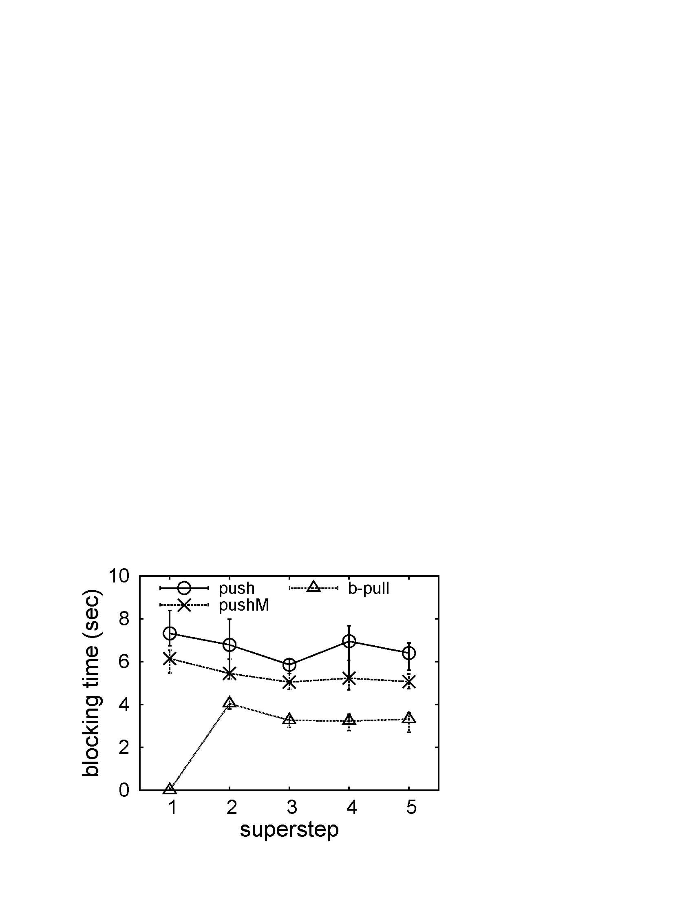

#HybridGraph
HybridGraph is a Pregel-like system which hybriding Pulling/Pushing for I/O-Efficient distributed and iterative graph computing.

##1. Introduction
Billion-scale graphs are rapidly growing in size in many applications. That has been driving much of the research on enhancing the performance of distributed graph systems, in terms of graph partitioning, network communication, and the convergence. `HybridGraph` focuses on performing graph analysis on a cluster I/O-efficiently, since the memory resource of a given computer cluster can be easily exhausted. 
Specially, HybridGraph employs a `hybrid` solution to support switching between push and pull adaptively to obtain optimal performance in different scenarios. 

Features of HybridGraph:
* ___Block-centric pull mechanism (b-pull):___ First, the I/O accesses are shifted from the receiver-sides where messages are written/read by push to the sender-sides where graph data are read by pull. Second, the block-centric technique greatly optimizes the I/O-efficiency of reading vertices.
* ___Hybrid engine:___ A seamless switching mechanism and a prominent performance prediction method to guarantee the efficiency when switching between push and b-pull.

The HybridGraph project started in 2011 on top of Apache Hama 0.2.0-incubating. HybridGraph is a Java framework, which runs in the cloud.

##2. Quick Start
###2.1 Requirements
* hadoop-0.20.2
* Sun Java JDK 1.6.x or higher version

###2.2 Configurations
* __$HybridGraph_HOME/conf/termite-env.sh:__ setting up the Java path.  
`export JAVA_HOME=/usr/java/jdk1.6.0_23`  
* __$HybridGraph_HOME/conf/termite-site.xml:__ setting up the configurations of HybridGraph engine.  
  `<property>`  
  `<name>bsp.master.address</name>`  
  `<value>master:40000</value>`  
  `<description>The hostname of the master server and the port master should bind to.</description>`  
  `</property>`  
	`<property>`  
	`<name>fs.default.name</name>`  
	`<value>hdfs://master:9000/</value>`  
  ``<description>The NameNode information of HDFS.</description>``  
	`</property>`  
	`<property>`  
	`<name>bsp.child.java.opts</name>`  
	`<value>-Xmx512m</value>`  
  `<description>Java opts for the child process run on workers(slaves).</description>`  
	`</property>`  
	`<property>`  
	`<name>bsp.task.max</name>`  
	`<value>1</value>`  
  ``<description>The maximum number of child processes that will be run simultaneously by a worker(slave).</description>``  
	`</property>`  
	`<property>`  
	`<name>bsp.local.dir</name>`  
	`<value>/tmp/termite_tmp_data</value>`  
  ``<description>Temporary directory on the local filesystem.</description>``  
	`</property>`  
* __$HybridGraph_HOME/conf/workers:__ settting up workers of HybridGraph.  
`slave1`  
`slave2`  
* __Setting up Linux `/etc/profile`.__  
`export TERMITE_HOME=/usr/termite-0.1`  
`export TERMITE_CONF_DIR=/usr/termite-0.1/conf`  
`export PATH=$PATH:$TERMITE_HOME/sbin`  

###2.3 Starting HybridGraph  
* __starting HDFS:__  
`start-dfs.sh`  
* __starting HybridGraph after NameNode has left safemode:__  
`$TERMITE_HOME/sbin/start-termite.sh`  
* __stopping HybridGraph:__  
`$TERMITE_HOME/sbin/stop-termite.sh`  

###2.4 Running a Single Source Shortest Path (SSSP) job  
First, create an example graph under input/file.txt on HDFS with the follwing:  
`source_vertex_id \t target_vertex_id_1:target_vertex_id_2:...`  
`1	2:3:4`  
`2	1:4`  
`3	2:1`  
`4	2`  
Second, submit the SSSP job with different models:  
* __SSSP (using b-pull):__  
`$TERMITE_HOME/sbin/termite jar $TERMITE_HOME/termite-examples-0.2.jar sssp.pull input output 5 50 4847571 13 10000 2`  
About arguments:  
[1] input directory on HDFS  
[2] output directory on HDFS  
[3] the number of child processes (tasks)  
[4] the maximum number of supersteps  
[5] the total number of vertices  
[6] the number of VBlocks per task  
[7] the sending threshold  
[8] the source vertex id  
* __SSSP (using hybrid):__  
`$TERMITE_HOME/sbin/termite jar $TERMITE_HOME/termite-examples-0.2.jar sssp.hybrid input output 5 50 4847571 13 10000 10000 10000 2 2`  
About arguments:  
[1] input directory on HDFS  
[2] output directory on HDFS  
[3] the number of child processes (tasks)  
[4] the maximum number of supersteps  
[5] the total number of vertices  
[6] the number of VBlocks per task  
[7] the sending threshold used by b-pull  
[8] the sending threshold used by push  
[9] the receiving buffer size per task used by push  
[10] starting style: 1--push, 2--b-pull  
[11] the source vertex id  

##3. Testing Report

  
