#HybridGraph
HybridGraph is a Pregel-like system which hybrids Pulling/Pushing for I/O-Efficient distributed and iterative graph computing.

##1. Introduction
Billion-scale graphs are rapidly growing in size in many applications. That has been driving much of the research on enhancing the performance of distributed graph systems, in terms of graph partitioning, network communication, and the convergence. `HybridGraph` focuses on performing graph analysis on a cluster I/O-efficiently, since the memory resource of a given computer cluster can be easily exhausted. 
Specially, HybridGraph employs a `hybrid` solution to support switching between push and pull adaptively to obtain optimal performance in different scenarios. 

Features of HybridGraph:
* ___Block-centric pull mechanism (b-pull):___ First, the I/O accesses are shifted from receiver sides where messages are written/read by push to sender sides where graph data are read by pull. Second, the block-centric technique greatly optimizes the I/O-efficiency of reading vertices.
* ___Hybrid engine:___ A seamless switching mechanism and a prominent performance prediction method to guarantee the efficiency when switching between push and b-pull.

The HybridGraph project started at Northeastern Univeristy (China) in 2011. HybridGraph is a Java framework implemented on top of Apache Hama 0.2.0-incubating.

##2. Quick Start
###2.1 Requirements
* hadoop-0.20.2
* Sun Java JDK 1.6.x or higher version

###2.2 Configurations
* __$HybridGraph_HOME/conf/termite-env.sh:__ setting up the Java path.  
`export JAVA_HOME=/usr/java/jdk1.6.0_23`  
* __$HybridGraph_HOME/conf/termite-site.xml:__ setting up the configurations of HybridGraph engine.  
  `<property>`  
    `<name>bsp.master.address</name>`  
    `<value>master:40000</value>`  
    `<description>The hostname of the master server and the port master should bind to.</description>`  
  `</property>`  
  `<property>`  
    `<name>fs.default.name</name>`  
    `<value>hdfs://master:9000/</value>`  
    `<description>The NameNode information of HDFS.</description>`  
  `</property>`  
  `<property>`  
    `<name>bsp.child.java.opts</name>`  
    `<value>-Xmx512m -Xms256m</value>`  
    `<description>Java opts for the child process run on workers(slaves).</description>`  
  `</property>`  
  `<property>`  
    `<name>bsp.task.max</name>`  
    `<value>1</value>`  
    `<description>The maximum number of child processes that will be run simultaneously by a worker(slave).</description>`  
  `</property>`  
  `<property>`  
    `<name>bsp.local.dir</name>`  
    `<value>/tmp/termite_tmp_data</value>`  
    `<description>Temporary directory on the local filesystem.</description>`  
  `</property>`  
  `<property>`  
    `<name>rand.read.speed</name>`  
    `<value>1077</value>`  
    `<description>The speed of rand reads is 1077KB/s.</description>`  
  `</property>`  
  `<property>`  
    `<name>rand.write.speed</name>`  
    `<value>1071</value>`  
    `<description>The speed of rand writes is 1071KB/s.</description>`  
  `</property>`  
  `<property>`  
    `<name>network.speed</name>`  
    `<value>112</value>`  
    `<description>The network speed is 112MB/s.</description>`  
  `</property>`  
* __$HybridGraph_HOME/conf/workers:__ settting up workers of HybridGraph.  
`slave1`  
`slave2`  
* __Setting up Linux `/etc/profile`.__  
`export TERMITE_HOME=/usr/termite-0.1`  
`export TERMITE_CONF_DIR=/usr/termite-0.1/conf`  
`export PATH=$PATH:$TERMITE_HOME/sbin`  

###2.3 Starting HybridGraph  
* __starting HDFS:__  
`start-dfs.sh`  
* __starting HybridGraph after NameNode has left safemode:__  
`$TERMITE_HOME/sbin/start-termite.sh`  
* __stopping HybridGraph:__  
`$TERMITE_HOME/sbin/stop-termite.sh`  

###2.4 Running a Single Source Shortest Path (SSSP) job  
First, create an example graph under input/file.txt on HDFS with the follwing:  
`source_vertex_id \t target_vertex_id_1:target_vertex_id_2:...`  
`1	2:3:4`  
`2	1:4`  
`3	2:1`  
`4	2`  
Second, submit the SSSP job with different models:  
* __SSSP (using b-pull):__  
`$TERMITE_HOME/sbin/termite jar $TERMITE_HOME/termite-examples-0.2.jar sssp.pull input output 5 50 4847571 13 10000 2`  
About arguments:  
[1] input directory on HDFS  
[2] output directory on HDFS  
[3] the number of child processes (tasks)  
[4] the maximum number of supersteps  
[5] the total number of vertices  
[6] the number of VBlocks per task  
[7] the sending threshold  
[8] the source vertex id  
* __SSSP (using hybrid):__  
`$TERMITE_HOME/sbin/termite jar $TERMITE_HOME/termite-examples-0.2.jar sssp.hybrid input output 5 50 4847571 13 10000 10000 10000 2 2`  
About arguments:  
[1] input directory on HDFS  
[2] output directory on HDFS  
[3] the number of child processes (tasks)  
[4] the maximum number of supersteps  
[5] the total number of vertices  
[6] the number of VBlocks per task  
[7] the sending threshold used by b-pull  
[8] the sending threshold used by push  
[9] the receiving buffer size per task used by push  
[10] starting style: 1--push, 2--b-pull  
[11] the source vertex id  

##3. Testing Report
We have tested the performance of HybridGraph by comparing it with up-to-date push-based systems [Giraph-1.0.0](http://giraph.apache.org/) and [MOCgraph](http://www.vldb.org/pvldb/vol8/p377-zhou.pdf), 
and the modified pull-based sytem [GraphLab PowerGraph](https://github.com/HybridGraph/GraphLab-PowerGraph.git).

In the following, we assume that:  
* `push`: the original push approach used in Giraph  
* `pushM`: an advanced push method used in MOCgraph by online processing messages  
* `pull`: the well-known pull approach used in GraphLab PowerGraph  
* `b-pull`: the block-centric pull approach used in HybridGraph  
* `hybrid`: the hybrid mechanism combining push and b-pull in HybridGraph  

We run four algorithms ([PageRank](http://dl.acm.org/citation.cfm?id=1807184), [SSSP](http://dl.acm.org/citation.cfm?id=1807184), [LPA](http://arxiv.org/pdf/0709.2938.pdf), and [SA](http://dl.acm.org/citation.cfm?id=2465369)) over three real graphs ([livej](http://snap.stanford.edu/data/soc-LiveJournal1.html), 
[wiki](http://haselgrove.id.au/wikipedia.htm),
and [orkut](http://socialnetworks.mpi-sws.org/data-imc2007.html)). 
The cluster we used consists of 30 computational nodes with one
additional master node connected by a Gigabit Ethernet switch, where
each node is equipped with 2 Intel Core CPUs, 6GB RAM and a Hitachi
disk (500GB, 7,200 RPM).
In all the testing, each node runs one task,
to avoid the resource contention.

###3.1 Blocking time `push vs. b-pull` using PageRank  
Here, blocking time is the time when nodes are exchanging messages.
It is calculated by summing up the message exchanging time in iterations.
We run PageRank in this test and provide sufficient memory.
The following graphs show the average value and
fluctuant range (min-max) for blocking time using wiki and orkut
datasets. Note that b-pull starts exchanging messages from the 2nd superstep.  

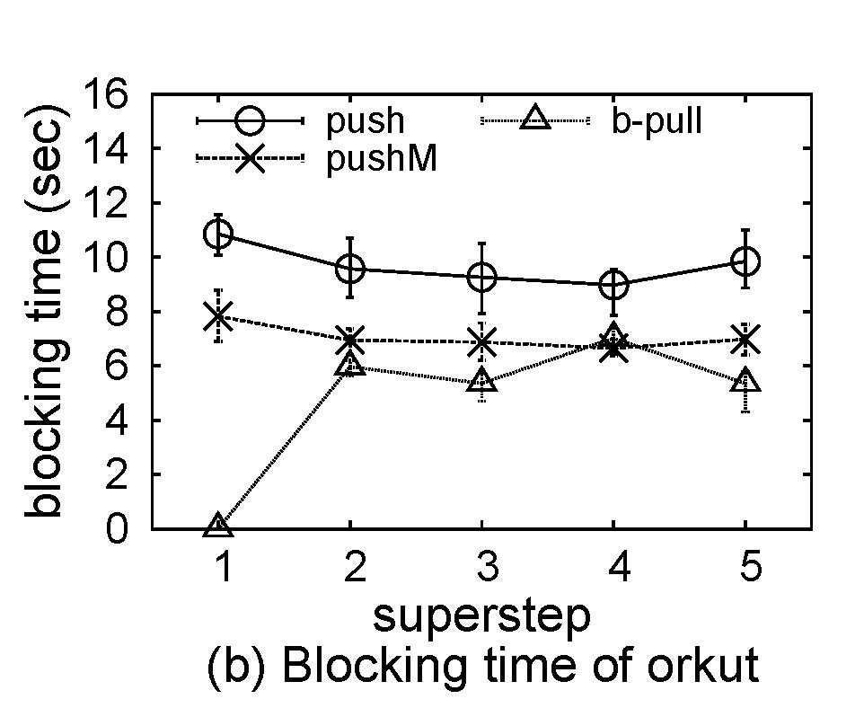  

###3.2 Network traffic `push vs. b-pull` using PageRank  
The network traffic includes all input and
output on bytes, and is extracted by [Ganglia](http://ganglia.sourceforge.net/),
a cluster monitoring tool, where the monitoring interval is for every 2 seconds. 
The almost 50% reduction of network traffic by b-pull is
due to concatenating messages to the same destinations.
In push, it is disable, as it is not cost-effective.
The traffic of pushM is as same
as that of push, as it cannot optimize communication costs.

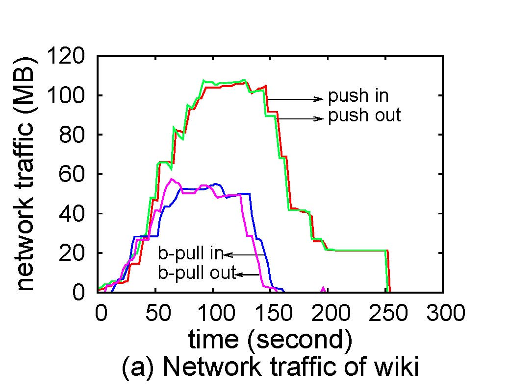
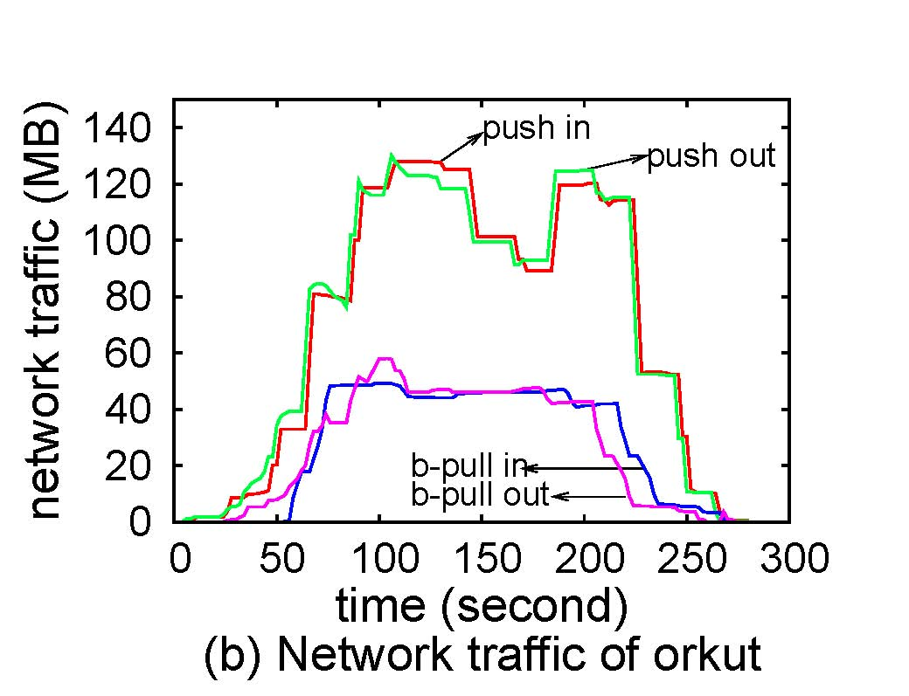  

###3.3 Testing runtime over wiki by varying the memroy resource  
The runtime of push obviously increases when the message buffer
decreases, since accessing messages on disk is extremely expensive.
Taking PageRank as an example, the
percentages of disk-resident messages are 0%, 86%, and 98%, when
the message buffer Bi reduces from `+infty` (i.e. sufficient memory)
to 3.5 million and 0.5 million.  And the runtime rapidly
increases from 10s to 24s and 64s, respectively.
pushM can alleviate it by online processing messages sent to
vertices resident in memory instead of spilling them onto disk.
However, the performance degenerates
when the buffer further decreases (such as 0.5 million).
This is because more vertices are resident on disk,
then each message received has less probabilities to be computed online.
b-pull and hybrid perform the best and their runtime is the same since hybrid 
always chooses b-pull as the optimal solution.
Finally, when Bi decreases, the performance of pull 
drastically degenerates due to frequently accessing vertices on disk
when pulling messages, which validates the I/O-inefficiency of
existing pull-based approaches. By contrast, our special data structure 
largely alleviates this problem in our b-pull and hybrid.

PageRank and SSSP  
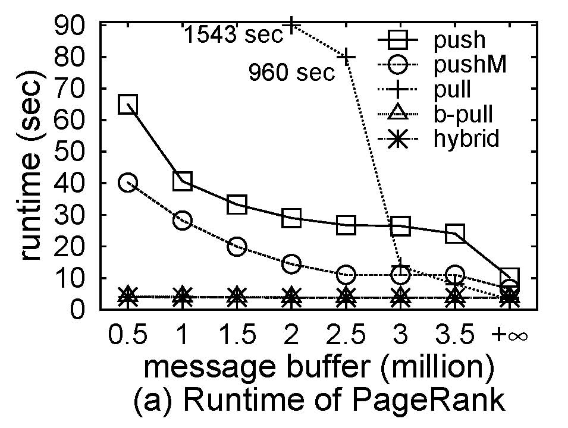
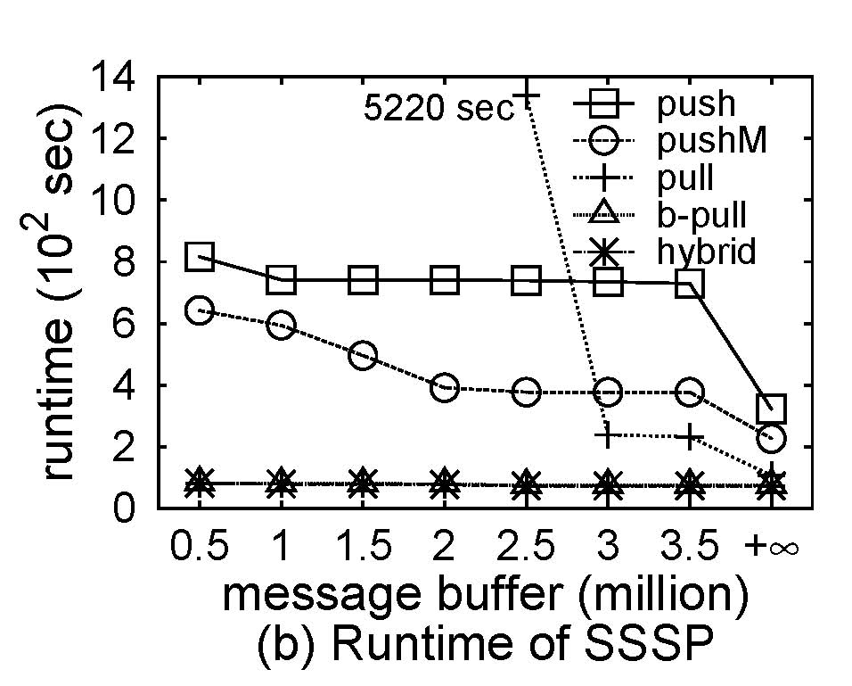  

LPA and SA  
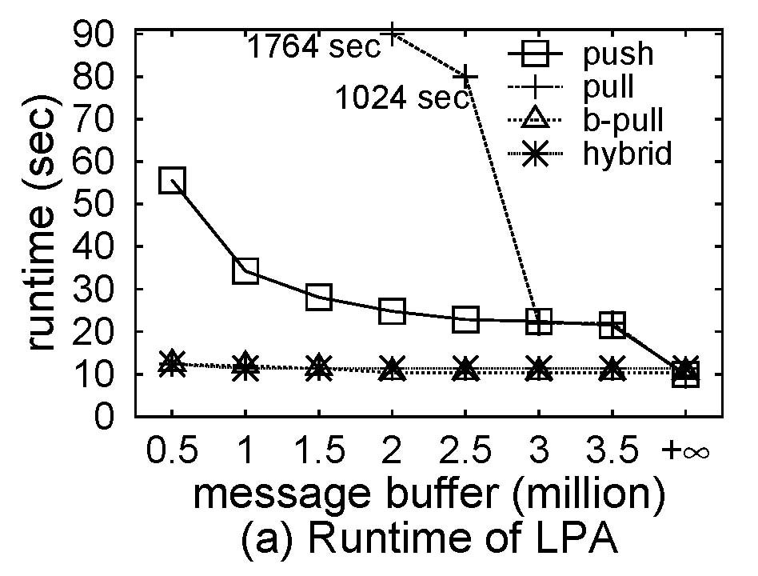
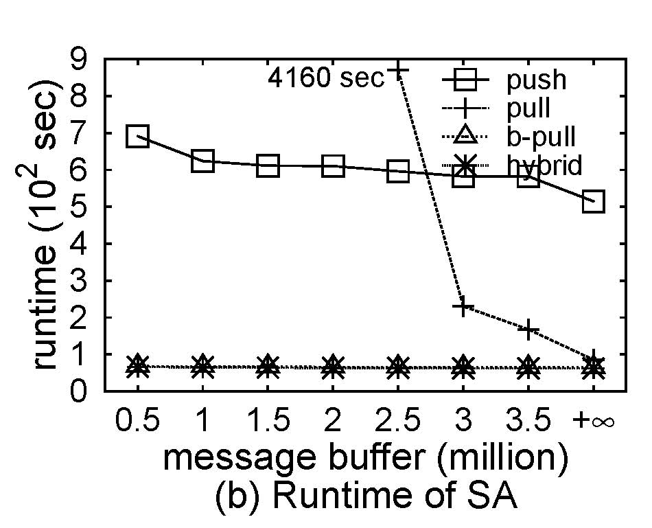  

###3.4 Scalability  
Scalability of computations for `push` and `hybrid` (LPA)  
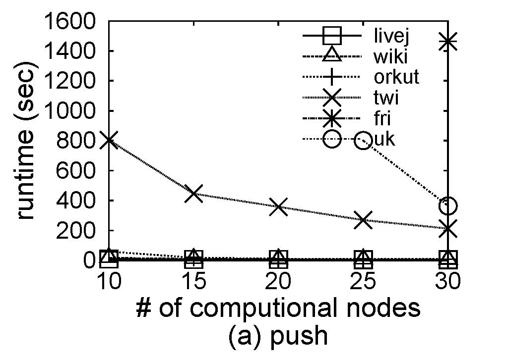
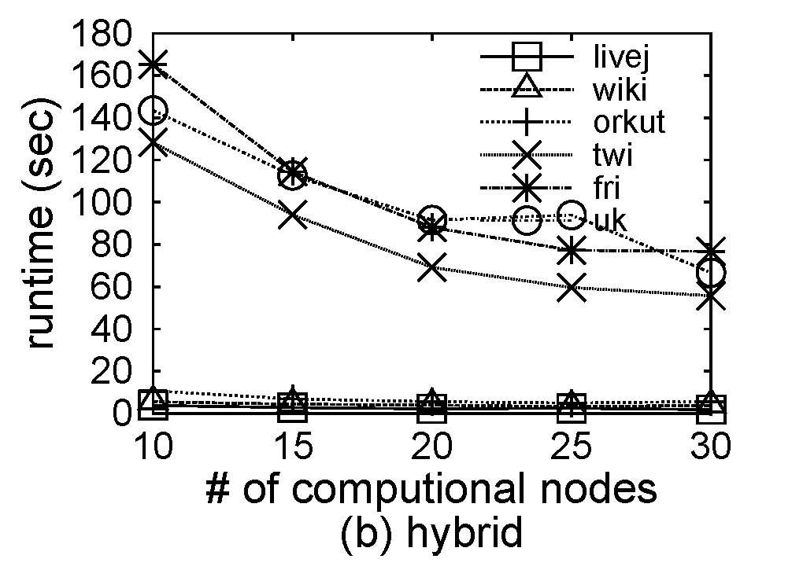  

Scalability of computations for `push` and `hybrid` (SA)  
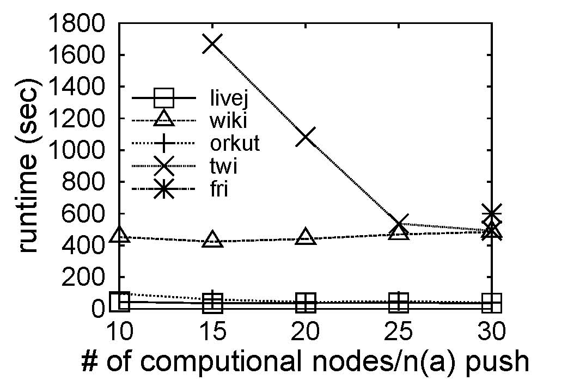
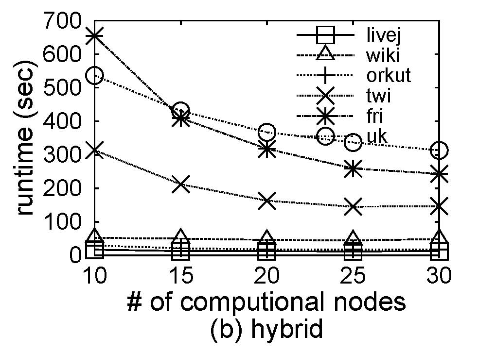  
